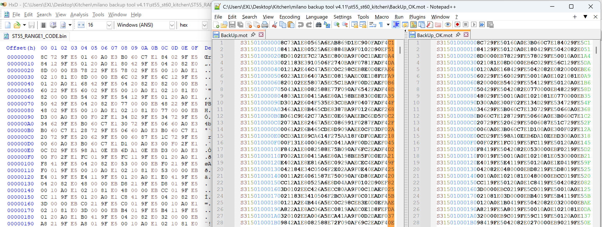

# Siemens ST55/ST60 Modding Kitchen

These ODM phones, manufactured by Quanta Computer, can now be patched just like original Siemens-platform phones!


## Requirements

1. A functional USB <=> RS-232 serial cable compatible with the ST55/ST60.

    *TODO: Verify and document pinout.*

2. [FTDI Driver](TODO) for the ST55/ST60 cable.
3. [Milano BackUp Tool v4.11](TODO) software.

## Patching Recipe

1. Create a full 16 MB (8+8 MB) `BackUp.mot` dump of your ST55/ST60 phone using the Milano BackUp Tool.
2. Decrypt the dump using the `MotTool.py` utility:

    ```sh
    python MotTool.py BackUp.mot BackUp_Dec.mot decrypt
    ```

3. Use the [HxD Hex Editor](https://mh-nexus.de/en/hxd/) to convert the `BackUp_Dec.mot` S-Record file into binary chunks.

    * Go to: **File => Import => Motorola S-Record**
    * Save the following memory ranges as binary files:
        * `0x01000000...0x01800000`
        * `0x20000000...0x207F0000`

    *Note: Alternatively, you can use command-line tools like `srec_cat` or `sre2bin` to extract these binary ranges.*

4. Apply your desired patches to the extracted binary files using your preferred tools.
5. Convert your patched binary back into an S-Record chunk using the `MotRec.py` utility:

    ```sh
    python ./MotRec.py -a 0x01000000 ST55_RANGE1_CODE.bin > Chunk.mot
    ```

6. Encrypt the `Chunk.mot` file so the phone/flasher can recognize it:

    ```sh
    python MotTool.py Chunk.mot Chunk_Enc.mot encrypt
    ```

7. Replace the corresponding block in the original crypted `BackUp.mot` file with your `Chunk_Enc.mot` data. You can use [Notepad++](https://notepad-plus-plus.org/) or any text editor that handles large S-Record files.

8. Flash the modified file back to the device using the Milano BackUp Tool.

## Theory

The Milano BackUp Tool utilizes a simple encryption method for its S-Record files.



The encryption logic involves appending each byte with its positional index within a `0x00...0x0F` range, which also encompasses the checksum.

## Credits

* **EXL** | MotoFan.Ru
* **alexa_ufo** | siepatchdb@c.j.r
* **Viktor89** | siepatchdb@c.j.r

© 10-Feb-2026
