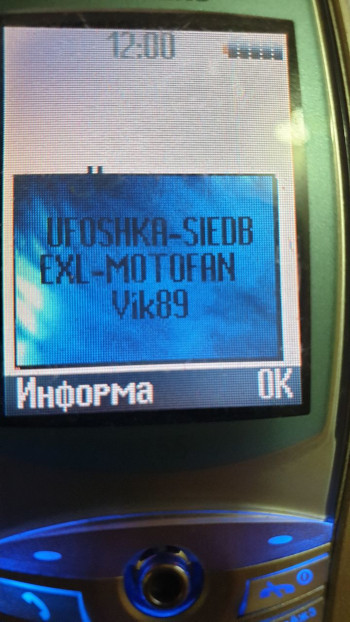
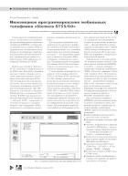
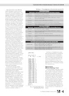
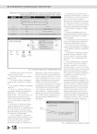
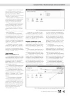
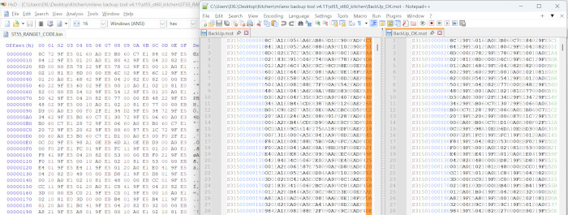

# Siemens ST55/ST60 Modding

The Siemens ST55/ST60 (ODM by Quanta Computer) can now be patched like original Siemens-platform phones.

[](img/ST55_Patched_02.jpg) [](img/ST55_Patched_01.jpg)

## Requirements

1. A functional USB <=> RS-232 serial cable compatible with the ST55/ST60.

    [](img/ST55_ST60_Cable_Pinout.png)

    ST55/ST60 pinout description (in Russian): [stuff/Pinout_ST55_ST60_ru_Ru.txt](stuff/Pinout_ST55_ST60_ru_Ru.txt)

2. [Milano BackUp Tool v4.11](stuff/MilanoBackUpTool_v4.11.zip) software with FTDI Driver for the ST55/ST60 cable.

## Flashing Recipe

[](img/ST_Page_01.png) [](img/ST_Page_02.png) [](img/ST_Page_03.png) [](img/ST_Page_04.png) [](img/ST_Page_05.png)

## Patching Recipe

1. Create a full 16 MB (8+8 MB) `BackUp.mot` dump of your ST55/ST60 phone using the Milano BackUp Tool.
2. Decrypt the dump using the `MotCipher.py` utility:

    ```sh
    python MotCipher.py BackUp.mot BackUp_Dec.mot decrypt
    ```

3. Use the [HxD Hex Editor](https://mh-nexus.de/en/hxd/) to convert the `BackUp_Dec.mot` S-Record file into binary chunks.

    * Go to: **File => Import => Motorola S-Record**
    * Save the following memory ranges as binary files:
        * `0x01000000...0x01800000`
        * `0x20000000...0x207F0000`

    *Note: Alternatively, you can use command-line tools like `srec_cat` or `sre2bin` to extract these binary ranges.*

4. Apply your desired patches to the extracted binary files using your preferred tools.
5. Convert your patched binary back into an S-Record chunk using the `MotRec.py` utility:

    ```sh
    python ./MotRec.py -a 0x01000000 ST55_RANGE1_CODE.bin > Chunk.mot
    ```

6. Encrypt the `Chunk.mot` file so the phone/flasher can recognize it:

    ```sh
    python MotCipher.py Chunk.mot Chunk_Enc.mot encrypt
    ```

7. Replace the corresponding block in the original crypted `BackUp.mot` file with your `Chunk_Enc.mot` data. You can use [Notepad++](https://notepad-plus-plus.org/) or any text editor that handles large S-Record files.

8. Flash the modified file back to the device using the Milano BackUp Tool.

## Graphic Patches

1. Open the firmware binary file in [Image Search Editor v2.09](https://forum.motofan.ru/index.php?act=Attach&type=post&id=278169) or a similar bitmap searching program.
2. Find and save image to the bitmap, including the offset address in the filename for reference.
3. Rename the file extension to `.data` and import it into [GIMP](https://www.gimp.org/) using a 120x160 resolution and the RGB565 (Big-Endian) format.
4. Edit the image as desired, then apply a Vertical Flip.
5. Export the file as a BMP image using the raw RGB565 format with no extra color space information.
6. Remove the BMP header using a Hex Editor to leave only the raw pixel data.
7. Swap the bytes in the resulting raw bitmap using the `MotSwap.py` utility:

    ```sh
    python MotSwap.py 0x01004000.bmp 0x01004000.bin
    ```

8. Re-insert the `0x01004000.bin` data into the firmware binary and prepare the final patch.

## Tools & Scripts

* `MotRec.py`: Converts binary files into Motorola S-Record format.
* `MotCipher.py`: Encrypts and decrypts Motorola S-Record files.
* `MotSwap.py`: Performs byte-swapping to correct the endianness of raw RGB565 bitmap images (without BMP header).

## Theory

The Milano BackUp Tool utilizes a simple encryption method for its S-Record files.

[](img/Crypto_Method.png)

The encryption logic involves appending each byte with its positional index within a `0x00...0x0F` range, which also encompasses the checksum.

The crypto algorithm was obtained by analyzing the memory dump of the Milano BackUp Tool process dumped by the [Process Explorer](https://learn.microsoft.com/en-us/sysinternals/downloads/process-explorer) program.

## Credits

* **EXL** | MotoFan.Ru
* **alexa_ufo** | siepatchdb@c.j.r
* **Viktor89** | siepatchdb@c.j.r

© 10-Feb-2026
